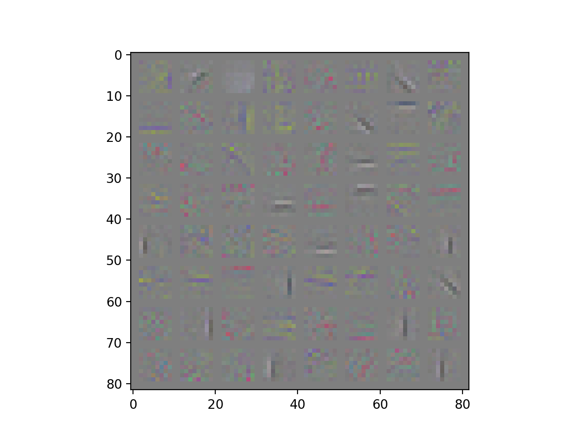

# ConvKMeans
Convoutional K-means for 1-D, 2-D and beyond

This repo is to develop Convolutional K-means in general for
exposing unsupervised clustering in GPUs with popular libraries such as
Theano, Tensorflow and Pytorch.

## Very Naive PyTorch Implementation

+ CIFAR-10
+ 30 batch of images, each batch as 64 images
+ 30 iterations
+ dataset mean and std removed
+ ZCA whitening
+ learning rate is 0.1

## Contacts

Yuhuang Hu  
Email: duguyue100@gmail.com
